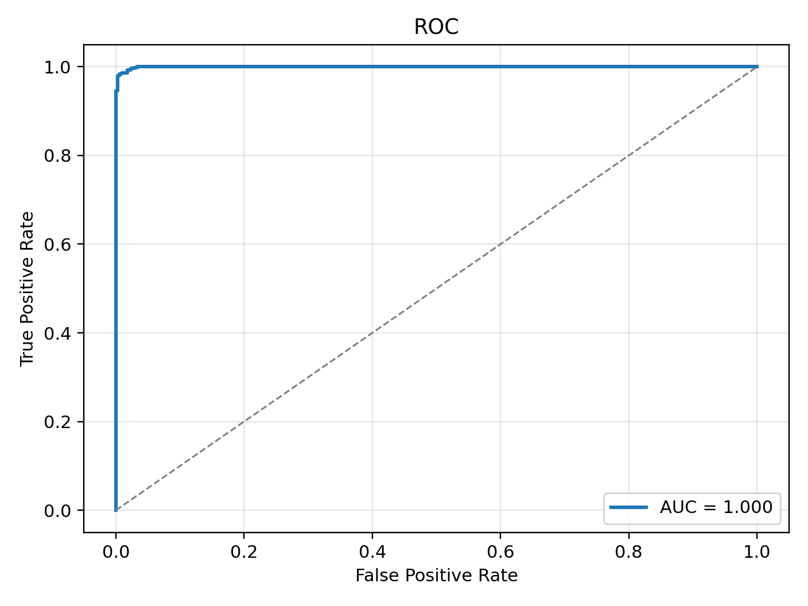
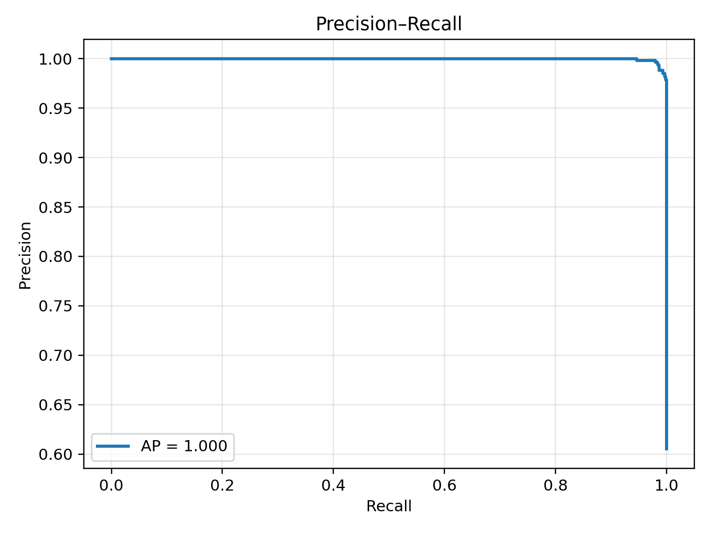
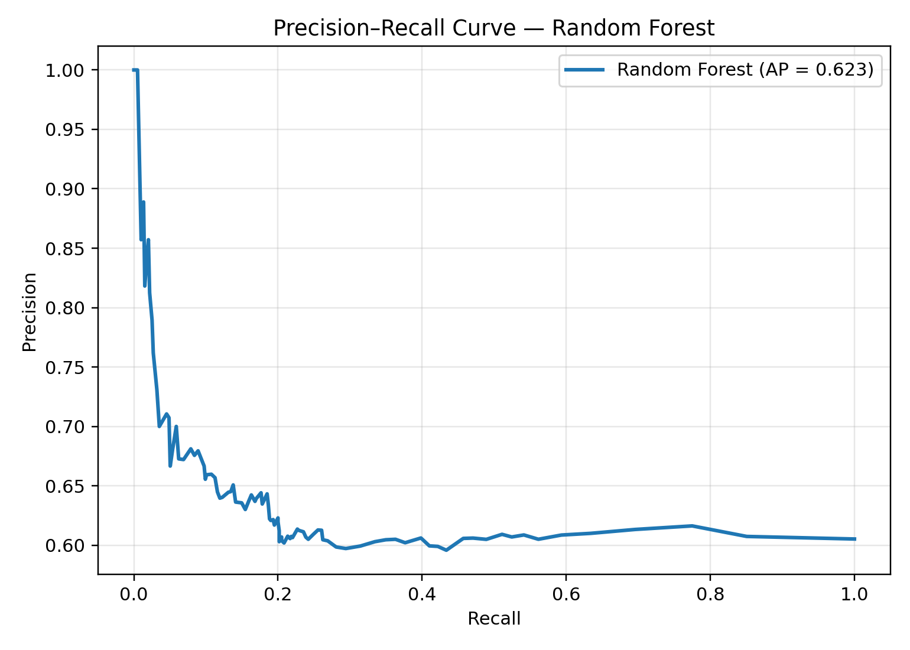
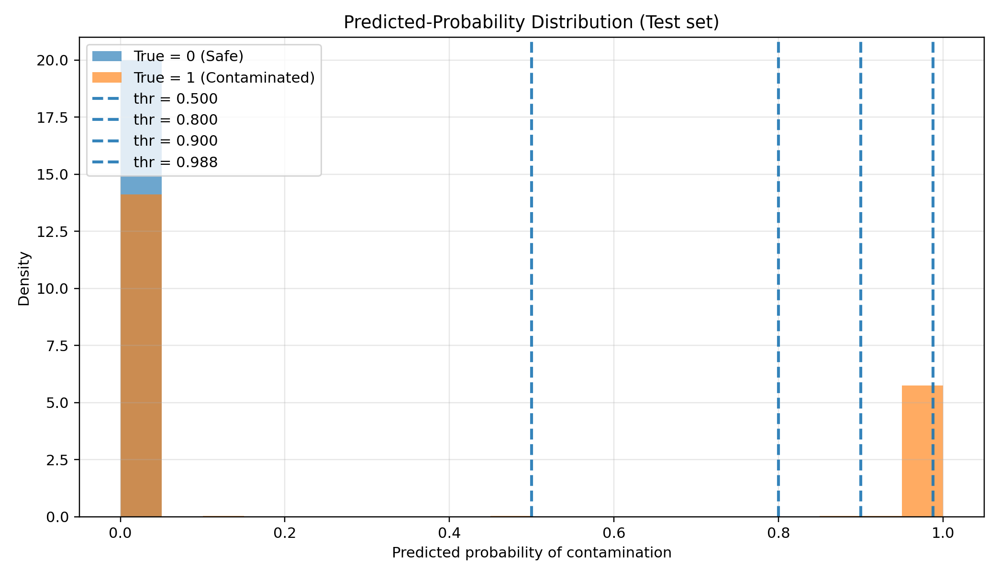

# Food Contamination Risk Prediction

## Project Overview

This project was developed as part of my Master's thesis and focuses on predicting food contamination risk using machine learning techniques. The objective is to analyze environmental and operational monitoring data to identify patterns associated with contamination events in food supply chains.

The project demonstrates data preprocessing, exploratory data analysis, machine learning modeling, and performance evaluation to support early detection of contamination risk.

---

## Dataset

The dataset used in this project contains simulated environmental and operational monitoring data representing food supply chain conditions.

Key features include:

* Temperature
* Humidity
* pH Level
* Gas Concentration
* Handling Score
* Seal Integrity
* Cleanliness Index
* Supply Delay
* Contamination Risk (Target Variable)

The dataset consists of **5,000 simulated supply chain records**.

---

## Tools & Technologies

* Python
* Pandas
* NumPy
* Scikit-learn
* XGBoost
* Matplotlib
* Seaborn
* SHAP (Explainable AI)
* Jupyter Notebook

---

## Methodology

The project follows a complete machine learning workflow:

1. Data preprocessing and cleaning
2. Exploratory data analysis (EDA)
3. Handling class imbalance using SMOTE
4. Training machine learning models (Logistic Regression, Random Forest, XGBoost)
5. Model evaluation using ROC-AUC and Precision-Recall metrics
6. Model explainability using SHAP values

---

## Model Results

The **XGBoost classifier** achieved the best performance.

Key performance metrics:

* **ROC-AUC:** 0.9996
* **PR-AUC:** 0.9997
* **Precision:** 1.000
* **Recall:** 0.850
* **F1 Score:** 0.919
* **Operating Threshold:** 0.988

At the selected threshold, the model achieved **perfect precision with zero false positives**, making it suitable for safety-critical contamination detection scenarios.

---

## Model Evaluation

### ROC Curve

The ROC curve illustrates the model’s ability to distinguish contaminated and safe samples.

---

### Precision–Recall Curve

The Precision–Recall curve evaluates the trade-off between precision and recall.

---

### Random Forest Precision–Recall Curve

Performance visualization for the Random Forest model.

---

### Predicted Probability Distribution

This visualization shows the distribution of predicted contamination probabilities.

---

## Additional Model Outputs

The repository also includes additional evaluation outputs:

* `confusion_matrix.csv`
* `operating_point_metrics.csv`
* `threshold_selection_table.csv`
* `shap_global_importance.csv`

These files contain model evaluation metrics and feature importance analysis.

---

## Project Files

food-contamination-risk-prediction
│
├── exp.ipynb
├── MasterThesis_ShamaArzeena_64348914.pdf
├── simulated_food_contamination_dataset.zip
│
├── ROC_curve.png
├── PR_curve.png
├── rf_precision_recall.png
├── probability_distribution.png
│
├── confusion_matrix.csv
├── operating_point_metrics.csv
├── shap_global_importance.csv
├── threshold_selection_table.csv
│
└── README.md

---

## Author

Shama Arzeena
Master's in Data Science
Aspiring Data Analyst
